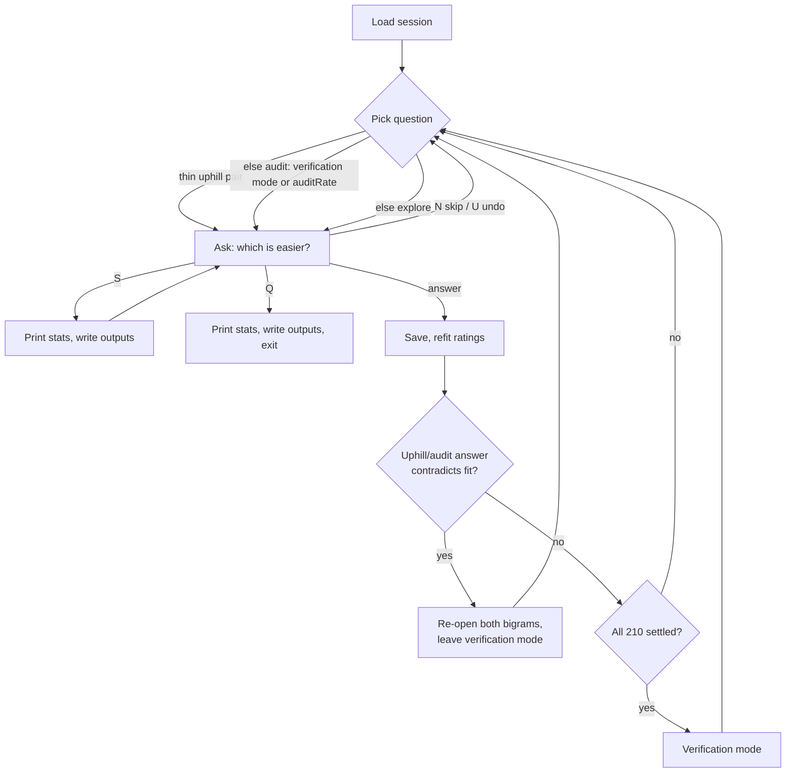

# Rank mode - how it works

Rank mode builds an effort ranking of all 210 ordered left-hand key pairs (bigrams) by
repeatedly asking which of two bigrams is easier to type. Answers are fitted into ratings,
compressed into effort tiers, and written to `keyboard.json` for the optimizer. Right-hand
pairs are mirrors and are not asked separately.

## Running

```sh
keyvolve -m rank
```

For configuration overrides and precedence, see the [CLI documentation](../../cliffa/README.md).

Every answer is saved to `session` immediately. Quit any time and run again to resume.

## Session flow



Question kinds: [Choosing the next question](#choosing-the-next-question). Outputs:
[Output](#output).

## Controls

Each prompt shows two bigrams with their right-hand mirrors, e.g. `1: TE[YI]   2: TD[YK]`.
Type each one on a QWERTY keyboard and pick the easier one.

| Input                         | Effect                                                                                                                  |
| ----------------------------- | ----------------------------------------------------------------------------------------------------------------------- |
| Ending letter, `1`, `2`       | Pick the winner. `TE` vs `TD` → `e` or `d`.                                                                             |
| Starting letter               | Pick the winner when both options end with the same key (`WD` vs `RD` → `w` or `r`). The prompt says when this applies. |
| `=`                           | Tie.                                                                                                                    |
| `!` suffix (`e!`, `1!`, `=!`) | Record the answer `forcedAnswerWeight` times.                                                                           |
| `N`                           | Skip without recording.                                                                                                 |
| `U`                           | Undo the last answer and ask it again.                                                                                  |
| `S`                           | Print stats and write all outputs.                                                                                      |
| `C`                           | Clear the screen.                                                                                                       |
| `Q`                           | Quit, print stats, write all outputs.                                                                                   |
| `?`                           | Show the controls.                                                                                                      |

Commands are uppercase so they never clash with answer letters. Only the last typed
character counts; other input is ignored and the question is asked again.

After each answer the prompt line is replaced with both bigrams' rating, deviation and
match count, plus the rating gap between them. Arrows show which way each value moved.

## Ratings and settling

Answers are fitted with a Bradley-Terry model: every bigram gets a rating (start `1500`),
and a bigger rating gap means a more predictable winner. The whole history is refitted after
every answer, so one wrong answer is outweighed by the rest. Repeating the same answer
adds evidence with diminishing returns. A `!` answer saturates the same way.

Each rating has a deviation (start `350`). Answers between near-equal bigrams shrink it
most; it never reaches zero.

A bigram is **settled** when it has no pending re-checks (see
[Contradictions](#contradictions)) and either:

- `matches >= maxMatches`, or
- `matches >= minMatches` and `deviation <= maxDeviation`.

A match is any recorded answer involving the bigram.

When all 210 bigrams are settled, the session enters **verification mode**: every
question becomes an audit. If a saved session was finished but the current settings leave
some bigrams unsettled, ranking resumes.

## Choosing the next question

The first rule that applies wins:

1. **Uphill** (`[uphill]` marker) - a pair whose direct answers favor the bigram the fit
   rates worse by more than `uphillGap`, with a head-to-head margin of at most
   `thinMargin`. Usually one noisy answer. Repeat it → the margin thickens and the
   ratings pull together. Answer the other way → the stray answer is outvoted. Either way
   the pair stops qualifying.
2. **Audit** (`[audit]` marker) - always in verification mode, otherwise with probability
   `auditRate`. Picks settled pairs with the same starting key whose answers fit the
   current ratings worst. Without such history it picks settled same-start pairs with the
   widest rating gap.
3. **Explore** - pairs with close ratings and high deviation. Pairs asked many times are
   deprioritized.

Each rule picks randomly among its top 10 candidates. The two options are shown in random
order. `forceCheckPair` overrides the first question of a run.

No valid pair left → the run stops with `No valid shared-key comparison is available`.

### Contradictions

On uphill and audit questions, an answer is a contradiction when the fitted gap exceeds
1.96 × the deviation of the difference between the two bigrams and the answer picks the
lower-rated side or a tie. Both bigrams then need 2 more answers before they can settle
again, and verification mode ends until they do.

### Majority cycles

The majority edge of a pair points from the side that won more than half of its direct
answers to the other. Ties and never-compared pairs have no edge. A cycle is a loop of
such edges, e.g. `TE → TD → TA → TE`.

Uphill questions print the cycle they belong to, with each bigram's rating and the gap
to the next one; a negative gap is the uphill edge. After the answer the tool prints
either `Cycle resolved` with the new order, or the cycle that still exists.

## Tiers and efforts

Fitted ratings are compressed into exactly `tierCount` tiers. Bigrams are sorted by rating
and split at the boundaries that minimize rating variation inside each tier.

Efforts follow the rating gaps between tiers:

1. Each tier takes the mean rating of its bigrams.
2. The best tier gets `effortMin`, the worst `effortMax`.
3. Tiers in between are placed by their rating distance from the best tier, bent by
   `effortGamma`.
4. Every bigram in a tier gets the tier's effort.

`tierCount`, `effortMin`, `effortMax` and `effortGamma` affect only output, not which
questions are asked.

## Stats screen

`S` and quit print the 10 best and worst bigrams, the settled count, an estimate of
answers left, and two health lines:

```
fit: log-loss 0.412, agreement 87%, spread/dev 14.2, tiers 9
tiers: R² 0.980 (rating variation preserved)
```

| Value        | Meaning                                                                                                                                                             |
| ------------ | ------------------------------------------------------------------------------------------------------------------------------------------------------------------- |
| `log-loss`   | Average surprise of the fit at your answers. `0.693` = coin flip; `0.3`-`0.5` = consistent session; rising over time = answers increasingly contradict the ratings. |
| `agreement`  | Share of non-tie answers won by the higher-rated bigram. `>85%` = clean; near `60%` = noisy, ratings get compressed and settling slows.                             |
| `spread/dev` | Rating range divided by mean deviation. `>10` = well resolved; `<5` = many bigrams indistinguishable.                                                               |
| `tiers`      | `tierCount`.                                                                                                                                                        |
| `R²`         | Share of rating variation kept by the tiers. Raise `tierCount` to keep more.                                                                                        |

Wide rating spread is the goal. Bunched ratings with low deviations mean contradictory
answers.

The stats also print the Spearman correlation between rating and key distance (see
[Output](#output)).

## Output

`S` and quit write three files:

| File                          | Content                                                                                                       |
| ----------------------------- | ------------------------------------------------------------------------------------------------------------- |
| `output`                      | Keyboard JSON: `efforts` (one per tier, best first) and `pairs` (left-hand from-slot → to-slot → tier index). |
| `report`                      | Block CSV: one 3×5 grid per starting key with efforts, ratings, deviations and match counts.                  |
| `bigrams.<ext>`               | Flat CSV in the `report` folder, with the `report` extension. One row per bigram, sorted by rating.           |

Flat CSV columns:

| Column                                                                                   | Meaning                                                                                             |
| ---------------------------------------------------------------------------------------- | --------------------------------------------------------------------------------------------------- |
| `rating_rank`                                                                            | Position in rating order (1-210).                                                                   |
| `bigram`, `mirror`                                                                       | Left-hand label and right-hand mirror.                                                              |
| `tier`                                                                                   | Tier, e.g. `5/12`. Its `effort` goes to the keyboard JSON.                                          |
| `majority_rank`                                                                          | Position in a flattened majority order, for inspection only. Cycle detection uses the raw edges.    |
| `rating`, `deviation`, `effort`, `matches`                                               | Fit details.                                                                                        |
| `distance`                                                                               | Distance between the two keys in key widths on a staggered keyboard (rows shifted 0 / 0.25 / 0.75). |
| `majority_score`, `majority_wins`, `majority_losses`, `majority_ties`, `majority_unseen` | Direct-answer breakdown.                                                                            |

Rating order and majority order can differ: ratings are inferred from all answers, the
majority order only from direct ones.

Two summary rows end the file:

- `spearman_rating_vs_distance` - `1` = ranking is pure key distance, `0` = no relation,
  negative = farther felt easier (check for inconsistent answers). `0.3`-`0.7` is healthy.
- `tier_r2` - same as `R²` on the stats screen.

The session file keeps the raw answer history, so later runs can re-verify or re-tier it
under different settings. It is also kept in the repo as a frozen log of all answers in case
ranking logic changes and the session needs to be rebuilt from the original evidence.

## Configuration

```yaml
rank:
  output: data/keyboard.json
  session: data/rank-session.json
  auditRate: 0.15
  maxDeviation: 98.5
  tierCount: 30
```

| Key                  | Default                  | Meaning                                                                                                                                                |
| -------------------- | ------------------------ | ------------------------------------------------------------------------------------------------------------------------------------------------------ |
| `output`             | `data/keyboard.json`     | Ranked keyboard JSON.                                                                                                                                  |
| `report`             | `output` with `.csv`     | Block CSV report. Its folder and extension also place the flat CSV.                                                                                    |
| `session`            | `data/rank-session.json` | Answer history for resume.                                                                                                                             |
| `auditRate`          | `0`                      | Probability (0-1) of an audit question before verification mode.                                                                                       |
| `minMatches`         | `10`                     | Matches a bigram needs before it can settle. Must be > 0.                                                                                              |
| `maxMatches`         | `30`                     | Matches after which a bigram settles regardless of deviation. Must be ≥ `minMatches`.                                                                  |
| `maxDeviation`       | `170`                    | Deviation at or below which a bigram settles after `minMatches`. Lower → more questions.                                                               |
| `uphillGap`          | `100`                    | Minimum rating gap for an uphill pair. Higher → fewer uphill questions.                                                                                |
| `thinMargin`         | `1.0`                    | Maximum head-to-head margin (wins minus half the answers) for an uphill pair. Lower → fewer uphill questions.                                          |
| `forcedAnswerWeight` | `3`                      | Answers recorded by one `!` answer. Must be > 0.                                                                                                       |
| `forceCheckPair`     | unset                    | First question of every run, as `XX-YY` left-hand labels, e.g. `AF-VE`.                                                                                |
| `tierCount`          | `10`                     | Number of effort tiers, 1-210.                                                                                                                         |
| `effortMin`          | `1.0`                    | Effort of the best tier. Must be < `effortMax`.                                                                                                        |
| `effortMax`          | `10.0`                   | Effort of the worst tier.                                                                                                                              |
| `effortGamma`        | `1.0`                    | `1` = efforts mirror rating gaps; `> 1` bunches easy tiers near `effortMin` with a harsh tail; `< 1` spreads easy tiers with a flat tail. Must be > 0. |
| `seed`               | random                   | Seed for a reproducible question order.                                                                                                                |

Invalid values stop the run with an error naming the key.

Tuning:

- Fewer questions → raise `maxDeviation`, or lower `minMatches` / `maxMatches`.
- More consistency checks during ranking → `auditRate: 0.1`.
- Fewer uphill questions → raise `uphillGap` or lower `thinMargin`. These don't affect
  settling.
