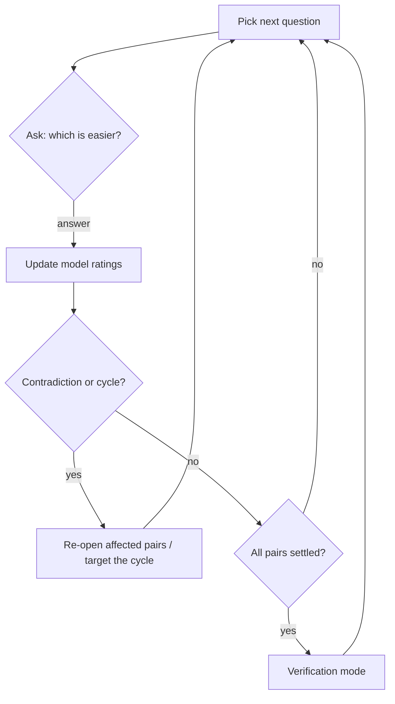
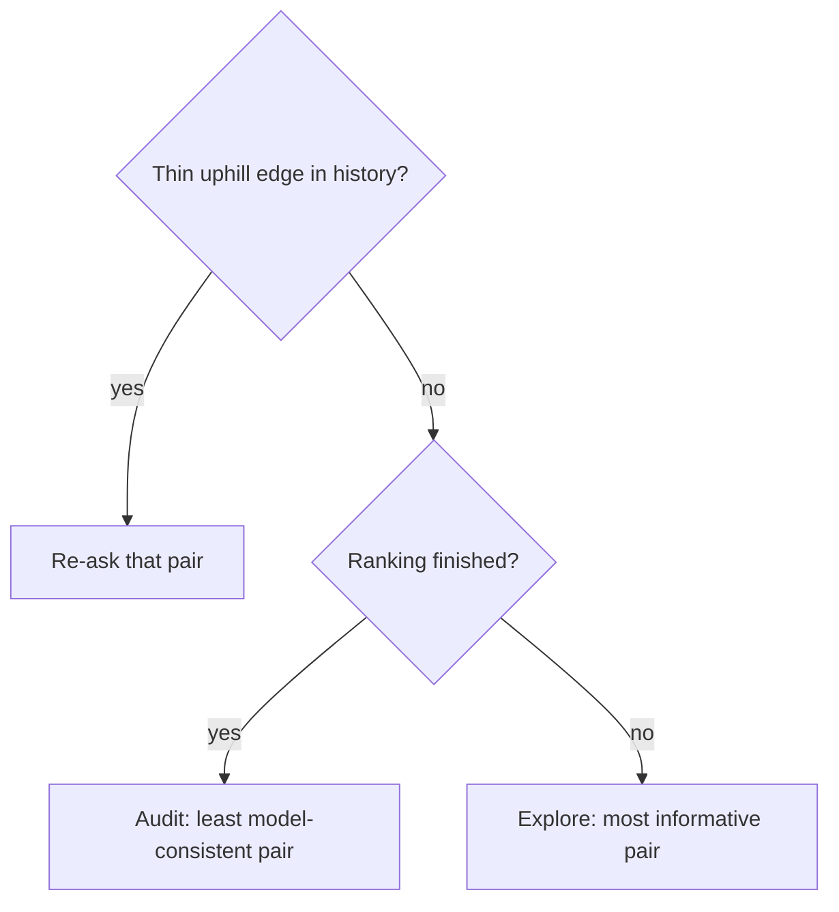
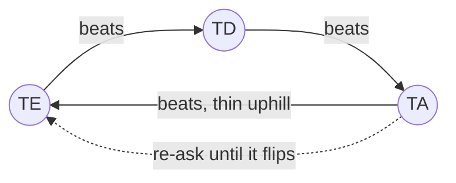

# Rank mode — how it works

Rank mode builds an *effort ranking* of all 210 ordered left-hand key pairs (bigrams) by
repeatedly asking one simple question: **which of these two bigrams is easier to type?**
Your answers feed a statistical model that converts pairwise preferences into a global
effort scale, later used by the optimizer via `keyboard.json`.

## The question loop

Most rounds show two bigrams starting from the same key (e.g. `TE` vs `TD`, with their
right-hand mirrors for reference). Rare uphill re-checks may instead share the ending key
(e.g. `WD` vs `RD`).

Answer with the ending letter, `1`/`2`, or `=` for a tie. If both options end with the same
letter, answer with the starting letter instead (the prompt tells you when this applies).
Every answer is saved immediately — quit any time, resume later.



## The rating model

Answers are fitted with a **Bradley–Terry model**: every bigram gets a rating, and the
probability that A beats B grows with the rating gap. All ratings are refitted from the
full answer history after every answer, so no single mistake is permanent — the model
weighs all evidence together and tolerates occasional noise.

Each rating carries an **uncertainty** (deviation) that shrinks as the bigram collects
answers. A bigram is *settled* once its rating is confident enough: sufficient matches,
low deviation, and a stable position in the final effort groups.

### How deviation changes

Deviation is not a simple per-match decay — it falls out of the full refit. After fitting,
the model measures how *sharply peaked* the solution is around each rating (the curvature
of the posterior); deviation is the width of that peak. Practical consequences:

- **Informative answers shrink it most.** A question between near-equals (close ratings)
  carries maximum information; an answer with an obvious winner teaches almost nothing.
- **Confidence flows through the graph.** Playing against a well-anchored opponent
  shrinks your deviation more than playing against an uncertain one.
- **It (almost) never grows.** Every answer adds information — even a contradictory one
  shrinks deviation. A contradiction hurts differently: it *compresses the rating gap*,
  making the pair harder to tell apart despite the smaller deviations. That's why
  settling checks bucket stability, not deviation alone.
- **It never reaches zero.** The prior keeps a floor; typical values fall from the
  initial 350 to ~100 after 15 matches.

For settling, what matters is the deviation of the *difference* between two bigrams,
which also accounts for their correlation — two pairs that moved together are easier to
tell apart than their individual deviations suggest.

### Reading the fit quality line

The stats screen (`S`) ends with a global health check of the whole ranking:

```
fit: log-loss 0.412, agreement 87%, spread/dev 14.2, tiers 9
```

- **log-loss** — average surprise of the model at your answers. For each answered pair
  the fitted ratings predict a win probability; log-loss punishes confident wrong
  predictions hardest. `0.693` = the model is no better than a coin flip; `0.3–0.5` =
  a consistent, well-fitted session; rising over time = your answers contradict the
  ratings more and more.
- **agreement** — share of decisive answers (ties excluded) where the higher-rated
  bigram actually won. `>85%` = clean signal; near `60%` = noisy or contradictory
  answers; the model then compresses ratings and settling slows down.
- **spread/dev** — rating range divided by mean deviation: how many "units of
  uncertainty" fit between the best and worst bigram. High (`>10`) = the ranking is
  well resolved and buckets are meaningful; low (`<5`) = items are still statistically
  indistinguishable, keep answering.
- **tiers** — how many statistically distinct levels (at 95% confidence) fit into the
  whole spread. This is the honest capacity estimate: compare with the configured
  `groups` — more groups than tiers means neighbouring buckets are not really
  distinguishable.

A healthy finished session has *wide* spread — big rating gaps are the goal, not a
problem. Dense, bunched-up ratings with low deviations mean the answers were
contradictory and the model gave up on separating items.

## Choosing the next question

Questions are not random. The picker maximizes learning per answer:

- **Explore** (normal): asks the pair whose answer carries the most *information* —
  bigrams close in rating and still uncertain. Repeatedly asked pairs are de-prioritized,
  and pairs where both sides still need work are preferred.
- **Uphill edges** (always first, marked `⚡`): a head-to-head majority pointing
  *against* a large fitted rating gap on a thin margin is usually one noisy answer
  bridging distant tiers — these edges seed most preference cycles. They are re-asked
  before anything else. Either answer resolves it:
  - pick the side the fit favors → the stray answer is outvoted, the phantom edge
    disappears and every cycle through it dissolves; tiers stay clean;
  - repeat the uphill answer → the disagreement is real: the refit pulls the two
    ratings together, the gap shrinks and both bigrams merge into one tier. The
    thicker margin also stops the edge from qualifying — no infinite re-asking.
- **Audit** (verification, marked `⚙`): re-checks pairs whose past answers fit the
  model *worst*, confirming or contradicting the saved ranking.

A small random pool among the top candidates keeps sessions varied, and the two options
are shown in random order to cancel position bias.



### How uphill edge detection works

Uphill edges are the key to maintaining consistent tiers without infinite cycles. Here is how
the system detects and handles them:

#### Step 1: Accumulate head-to-head tallies
For each unique pair in the history, the system tracks `(total_score_for_lower_index, match_count)`.
Scores are normalized so the lower-indexed item always gets a positive contribution when it wins.
Example:
```
TE (index 10) vs TD (index 11):
  Answer 1: TE wins → score += 1.0
  Answer 2: TD wins → score -= 1.0 (lower index gets -1.0)
  Answer 3: TE wins → score += 1.0
  Result: TE wins 3.5 / 3 matches, head-to-head margin = 0.5
```

#### Step 2: Detect uphill criteria
An edge qualifies as uphill when **both** conditions hold:
1. **Thin margin** — `margin.abs() <= 1.0` (difference between win total and 50%):
   - Stable edges have margins > 1.0; thin-margin edges can flip with one or two more answers.
   - This detects unstable contradictions, not settled disagreements.
2. **Large fitted gap** — `uphill > 130` effort units (≈ one effort-group width):
   - The fitted Bradley–Terry model predicts a large rating gap between them.
   - The head-to-head history contradicts this gap: the lower-rated item beats the higher-rated one.

Examples:

**Case 1:** `TE` (fitted rating 200) vs `TD` (fitted rating 320)
- Fitted gap: 320 - 200 = 120 units (below threshold, not uphill)
- Ignore, not enough contradiction to recheck

**Case 2:** `TE` (fitted rating 200) vs `TA` (fitted rating 350)
- Fitted gap: 350 - 200 = 150 units (above 130 threshold) ✓
- Head-to-head: TE beats TA by margin 0.8 (thin) ✓
- Uphill edge; likely one noisy answer bridging distant tiers

#### Step 3: Sort and pick from random pool
Among all uphill edges:
- Sort by gap size (largest gaps first; highest contradiction priority).
- Shuffle to avoid bias.
- Pick randomly from the top 10 candidates (`POOL`).

This ensures the biggest contradictions are re-asked first, but sessions stay varied.

#### Step 4: What answering does

**User confirms the uphill answer** (picks the previously-winning side again):
- Refit accumulates more evidence for that direction.
- The margin thickens (e.g., 0.8 → 2.0+).
- Edge no longer qualifies as thin-margin → dropped from uphill re-check.
- Ratings converge slightly (the gap shrinks); both may merge into one tier.
- Result: stable, repeatable answer; no contradiction.

**User picks the fit's side** (contradicts the head-to-head history):
- That answer is weighted against the thin uphill majority during refit.
- The stray answer is statistically outvoted (combined with earlier answers).
- Edge disappears or flips in head-to-head, ceasing to be uphill.
- Every preference cycle that relied on this edge dissolves.
- Result: tiers clean up; rating graph stays acyclic or harmless (same-tier noise).

#### Why this breaks cycles

Preference cycles (e.g., `A > B > C > A`) happen when contradictions chain across tiers.
Most harmful cross-tier cycles are bridged by a **single thin uphill edge** — exactly
what the picker targets first. Once that edge is re-asked and answered consistently,
the cycle either:
- **Flips** (the outvoted edge flips → cycle gone), or
- **Merges** (both sides move closer → cycle becomes same-tier noise, which Bradley–Terry
  tolerates via the posterior).

By re-asking uphill edges first, the system prevents cycles from establishing themselves
before exploration continues.

## Contradictions and cycles

Two consistency guards run continuously:

- **Contradiction**: during verification, an answer that flips a confidently ordered pair
  re-opens both bigrams — they must earn their confidence again.
- **Preference cycles** (`A > B > C > A`) are not chased directly. Cycles among
  same-tier bigrams are harmless noise that Bradley–Terry averages out; harmful
  cross-tier cycles are almost always bridged by a single thin *uphill edge*, which the
  picker re-asks first. Whichever way it is answered, the cycle stops being harmful:
  the edge either flips (cycle gone) or the tiers merge (cycle becomes same-tier noise).



## Finishing and output

When every bigram is settled the session enters **verification mode**: further answers
only confirm or challenge the saved ranking. On quit, the session prints stats and writes:

- a ranked `keyboard.json` — bigram efforts grouped into evenly spaced buckets,
- a CSV report with ratings, deviations, and match counts for inspection.

The session file keeps the raw answer history, so future runs can re-verify or refine the
ranking under different settings.

## Configuration

All settings live under `rank:` in `keyvolve.yaml`; every one has a sensible default.

| Setting | Default | Meaning |
| --- | --- | --- |
| `output` | `data/keyboard.ranked.json` | Ranked keyboard JSON (efforts + pair groups). |
| `report` | `output` with `.csv` | CSV visual report path. |
| `session` | `data/rank-session.json` | Saved answer history for pause/resume. |
| `auditRate` | `0` | Probability (0–1) that a question is an audit re-check instead of exploration. `0` = audits only after everything settles. |
| `minMatches` | `10` | Comparisons an item needs before it *can* settle. A match is any answered question involving the item. |
| `maxMatches` | `30` | Comparisons after which an item settles unconditionally — caps effort spent on stubborn boundary cases. |
| `maxDeviation` | `170` | Rating uncertainty an item must reach (together with a stable bucket) to settle before `maxMatches`. Lower = stricter = more questions. |
| `effortMin` | `1.0` | Effort assigned to the most preferable bucket in the output. |
| `effortMax` | `10.0` | Effort assigned to the least preferable bucket. |
| `groups` | `20` | Number of effort buckets in the output (1–210). More groups = finer effort resolution, longer sessions. |
| `bucketTolerance` | `1` | How many neighboring buckets an item may wobble across while still counting as stable. `0` = exact bucket required. |
| `seed` | random | RNG seed for a reproducible question order. |

Rules of thumb:

- Fewer questions → raise `maxDeviation`, lower `minMatches`/`maxMatches`, or reduce `groups`.
- Higher confidence → the opposite; add `auditRate: 0.1` to weave consistency checks into
  a normal session.
- `effortMin`/`effortMax` only scale the output; they don't affect ranking itself.
