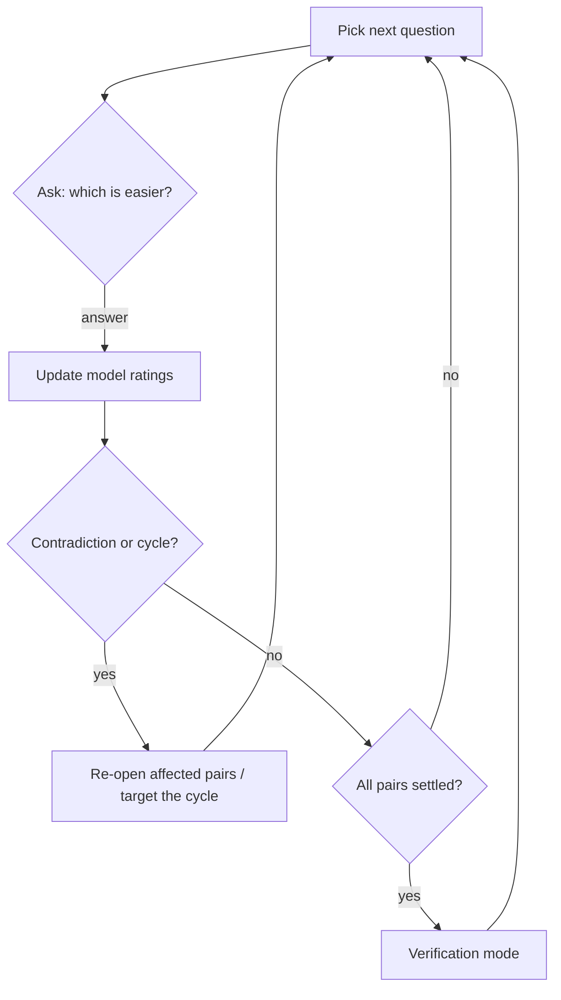
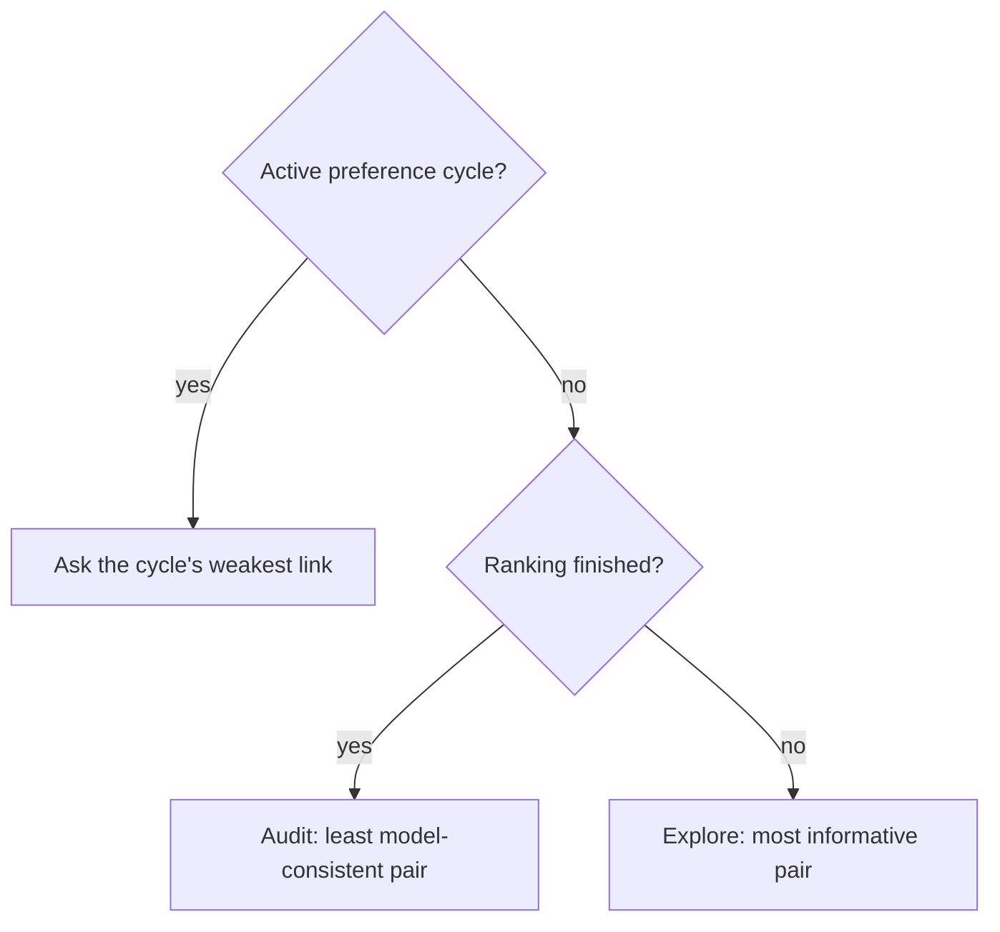
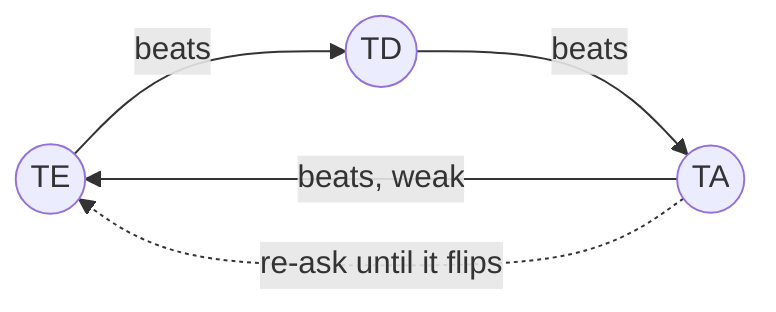

# Rank mode — how it works

Rank mode builds an *effort ranking* of all 210 ordered left-hand key pairs (bigrams) by
repeatedly asking one simple question: **which of these two bigrams is easier to type?**
Your answers feed a statistical model that converts pairwise preferences into a global
effort scale, later used by the optimizer via `keyboard.json`.

## The question loop

Each round shows two bigrams starting from the same key (e.g. `TE` vs `TD`, with their
right-hand mirrors for reference). You answer with the ending letter, `1`/`2`, or `=` for
a tie. Every answer is saved immediately — quit any time, resume later.

## The rating model

Answers are fitted with a **Bradley–Terry model**: every bigram gets a rating, and the
probability that A beats B grows with the rating gap. All ratings are refitted from the
full answer history after every answer, so no single mistake is permanent — the model
weighs all evidence together and tolerates occasional noise.

Each rating carries an **uncertainty** (deviation) that shrinks as the bigram collects
answers. A bigram is *settled* once its rating is confident enough: sufficient matches,
low deviation, and a stable position in the final effort groups.

### How deviation changes

Deviation is not a simple per-match decay — it falls out of the full refit. After fitting,
the model measures how *sharply peaked* the solution is around each rating (the curvature
of the posterior); deviation is the width of that peak. Practical consequences:

- **Informative answers shrink it most.** A question between near-equals (close ratings)
  carries maximum information; an answer with an obvious winner teaches almost nothing.
- **Confidence flows through the graph.** Playing against a well-anchored opponent
  shrinks your deviation more than playing against an uncertain one.
- **It can grow.** A contradictory answer moves the optimum and flattens the peak —
  deviation goes back up until new answers restore confidence.
- **It never reaches zero.** The prior keeps a floor; typical values fall from the
  initial 350 to ~100 after 15 matches.

For settling, what matters is the deviation of the *difference* between two bigrams,
which also accounts for their correlation — two pairs that moved together are easier to
tell apart than their individual deviations suggest.

## Choosing the next question

Questions are not random. The picker maximizes learning per answer:

- **Explore** (normal): asks the pair whose answer carries the most *information* —
  bigrams close in rating and still uncertain. Repeatedly asked pairs are de-prioritized,
  and pairs where both sides still need work are preferred.
- **Audit** (verification): re-checks pairs whose past answers fit the model *worst*,
  confirming or contradicting the saved ranking.
- **Cycle breaking**: when preferences form a loop, questions target the loop directly
  (see below).

A small random pool among the top candidates keeps sessions varied, and the two options
are shown in random order to cancel position bias.

## Contradictions and cycles

Two consistency guards run continuously:

- **Contradiction**: during verification, an answer that flips a confidently ordered pair
  re-opens both bigrams — they must earn their confidence again.
- **Preference cycle**: answers can form a loop (`A > B > C > A`), which no ranking can
  satisfy. When detected, the loop is printed and the next questions attack its *weakest
  link* — the pairing with the slimmest majority — until one answer flips and the loop
  dissolves.

## Finishing and output

When every bigram is settled the session enters **verification mode**: further answers
only confirm or challenge the saved ranking. On quit, the session prints stats and writes:

- a ranked `keyboard.json` — bigram efforts grouped into evenly spaced buckets,
- a CSV report with ratings, deviations, and match counts for inspection.

The session file keeps the raw answer history, so future runs can re-verify or refine the
ranking under different settings.

## Configuration

All settings live under `rank:` in `keyvolve.yaml`; every one has a sensible default.

| Setting | Default | Meaning |
| --- | --- | --- |
| `output` | `data/keyboard.ranked.json` | Ranked keyboard JSON (efforts + pair groups). |
| `report` | `output` with `.csv` | CSV visual report path. |
| `session` | `data/rank-session.json` | Saved answer history for pause/resume. |
| `auditRate` | `0` | Probability (0–1) that a question is an audit re-check instead of exploration. `0` = audits only after everything settles. |
| `minMatches` | `10` | Comparisons an item needs before it *can* settle. A match is any answered question involving the item. |
| `maxMatches` | `30` | Comparisons after which an item settles unconditionally — caps effort spent on stubborn boundary cases. |
| `maxDeviation` | `170` | Rating uncertainty an item must reach (together with a stable bucket) to settle before `maxMatches`. Lower = stricter = more questions. |
| `effortMin` | `1.0` | Effort assigned to the most preferable bucket in the output. |
| `effortMax` | `10.0` | Effort assigned to the least preferable bucket. |
| `groups` | `20` | Number of effort buckets in the output (1–210). More groups = finer effort resolution, longer sessions. |
| `bucketTolerance` | `1` | How many neighboring buckets an item may wobble across while still counting as stable. `0` = exact bucket required. |
| `seed` | random | RNG seed for a reproducible question order. |

Rules of thumb:

- Fewer questions → raise `maxDeviation`, lower `minMatches`/`maxMatches`, or reduce `groups`.
- Higher confidence → the opposite; add `auditRate: 0.1` to weave consistency checks into
  a normal session.
- `effortMin`/`effortMax` only scale the output; they don't affect ranking itself.
