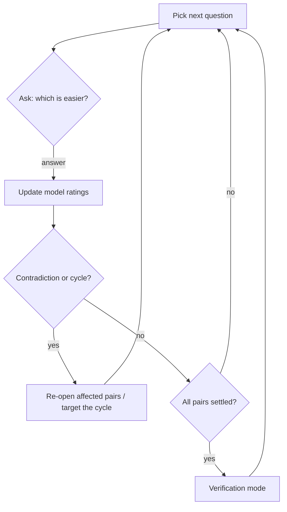
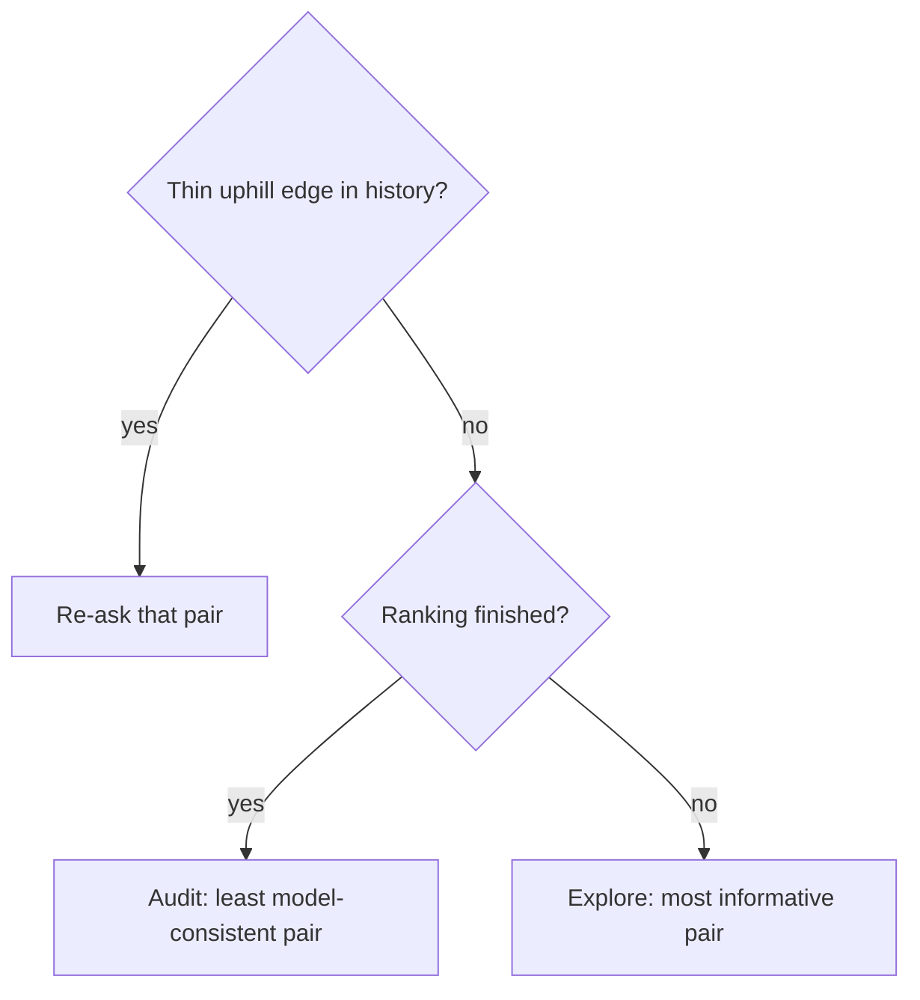
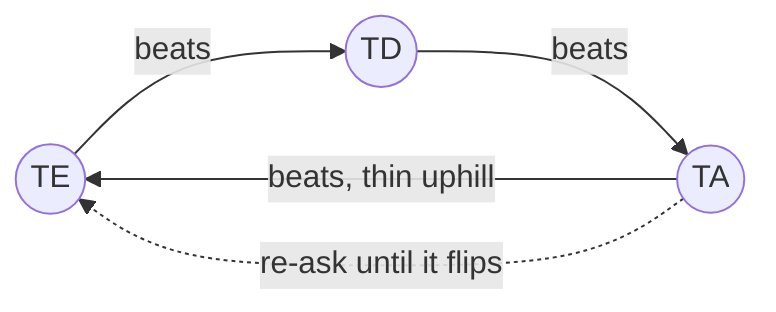

# Rank mode — how it works

Rank mode builds an *effort ranking* of all 210 ordered left-hand key pairs (bigrams) by
repeatedly asking one simple question: **which of these two bigrams is easier to type?**
Your answers feed a statistical model that converts pairwise preferences into a global
effort scale, later used by the optimizer via `keyboard.json`.

## The question loop

Most rounds show two bigrams starting from the same key (e.g. `TE` vs `TD`, with their
right-hand mirrors for reference). Rare uphill re-checks may instead share the ending key
(e.g. `WD` vs `RD`).

Answer with the ending letter, `1`/`2`, or `=` for a tie. Add `!` at the end for a **strong
confirmation** (`e!`, `1!`, `=!`). That records several confirmations at once, so you do not
need to type the same answer many times manually. If both options end with the same letter,
answer with the starting letter instead (the prompt tells you when this applies).
Every answer is saved immediately — quit any time, resume later.



## The rating model

Answers are fitted with a **Bradley–Terry model**: every bigram gets a rating, and the
probability that A beats B grows with the rating gap. All ratings are refitted from the
full answer history after every answer, so no single mistake is permanent — the model
weighs all evidence together and tolerates occasional noise.

Repeated confirmations have **diminishing returns**. Re-answering the same pair in the
same direction still adds evidence, but each extra confirmation counts less than the
previous one. This keeps stable preferences from exploding into artificially huge gaps just
because they were repeated many times. A `!` answer is simply a shortcut for repeating the
same answer several times — it saturates the same way.

Each rating carries an **uncertainty** (deviation) that shrinks as the bigram collects
answers. A bigram is *settled* once it has sufficient matches and low deviation.
Unresolved distinctions no longer block settling: statistically overlapping bigrams share
one adaptive tier and therefore one final effort.

### How deviation changes

Deviation is not a simple per-match decay — it falls out of the full refit. After fitting,
the model measures how *sharply peaked* the solution is around each rating (the curvature
of the posterior); deviation is the width of that peak. Practical consequences:

- **Informative answers shrink it most.** A question between near-equals (close ratings)
  carries maximum information; an answer with an obvious winner teaches almost nothing.
- **Confidence flows through the graph.** Playing against a well-anchored opponent
  shrinks your deviation more than playing against an uncertain one.
- **Repeated confirmations still help, but saturate.** Repeats strengthen the fit with
  diminishing returns; `!` records several confirmations at once without re-asking.
- **It (almost) never grows.** Every answer adds information — even a contradictory one
  shrinks deviation. A contradiction hurts differently: it *compresses the rating gap*,
  making the pair harder to tell apart despite the smaller deviations. Compressed,
  statistically overlapping ratings merge into one adaptive tier.
- **It never reaches zero.** The prior keeps a floor; typical values fall from the
  initial 350 to ~100 after 15 matches.

For settling, what matters is the deviation of the *difference* between two bigrams,
which also accounts for their correlation — two pairs that moved together are easier to
tell apart than their individual deviations suggest.

### Adaptive tiers and final efforts

Two independent mechanisms produce the final efforts — one decides *where* the tiers are,
the other decides *what effort* each tier gets.

**Finding tiers** is the job of `tierSplitZ`. Bigrams are sorted by rating, best first. The
best item starts a tier. Following items remain in that tier until one is confidently worse
than the tier anchor:

```text
anchor rating - candidate rating > tierSplitZ × deviation(anchor - candidate)
```

That candidate starts the next tier. The comparison uses posterior covariance, so correlated
ratings are handled correctly. More evidence shrinks difference deviation and can split a
previously broad tier. This is also where the tier *count* comes from: it grows on its own
as evidence accumulates — nothing else supplies it. Splits only happen at statistically real
gaps, which is why tiers stay stable between runs and why noise never creates a boundary
(the tier quality line below measures how little this safety costs).

Prefer a concrete number over the statistical threshold? Set `tierCount` and the splitter is
bypassed: the ratings are cut into exactly that many tiers at the best possible boundary
positions (the same optimal partition the tier quality line compares against). The
trade-off: boundaries are no longer confidence-gated, so with few answers they may separate
statistically indistinguishable pairs and drift between runs.

Which to use? `tierCount` shifts the hard question onto you: *how many tiers does the data
support?* Too few merges genuinely different pairs into one effort; too many splits
statistically identical ones apart. The adaptive splitter answers that question from
evidence — so the practical recipe is: rank with the default adaptive tiers, note the tier
count it discovers, and only pin `tierCount` if you deliberately want a different
granularity for the generated keyboard (e.g. fewer, coarser effort levels).

**Assigning efforts** is proportional to the rating gaps between the found tiers. Each tier
takes the mean rating of its items; the best tier's mean is pinned to `effortMin`, the worst
to `effortMax`, and every tier in between lands proportionally to its rating distance from
the best. Two tiers separated by a large felt-effort gap therefore get a large effort gap,
near-equal tiers get near-equal efforts. `effortGamma` optionally bends this line (see the
configuration table). Every bigram in a tier receives exactly the same effort.

### Reading the fit quality line

The stats screen (`S`) ends with a global health check of the whole ranking:

```
fit: log-loss 0.412, agreement 87%, spread/dev 14.2, tiers 9
```

- **log-loss** — average surprise of the model at your answers. For each answered pair
  the fitted ratings predict a win probability; log-loss punishes confident wrong
  predictions hardest. `0.693` = the model is no better than a coin flip; `0.3–0.5` =
  a consistent, well-fitted session; rising over time = your answers contradict the
  ratings more and more.
- **agreement** — share of decisive answers (ties excluded) where the higher-rated
  bigram actually won. `>85%` = clean signal; near `60%` = noisy or contradictory
  answers; the model then compresses ratings and settling slows down.
- **spread/dev** — rating range divided by mean deviation: how many "units of
  uncertainty" fit between the best and worst bigram. High (`>10`) = the ranking is
  well resolved; low (`<5`) = many items remain statistically indistinguishable.
- **tiers** — actual number of adaptive confidence tiers currently produced. This is also
  the number of effort entries written to the ranked keyboard JSON.

A healthy finished session has *wide* spread — big rating gaps are the goal, not a
problem. Dense, bunched-up ratings with low deviations mean the answers were
contradictory and the model gave up on separating items.

### Reading the tier quality line

Right after the fit line, the stats screen checks one thing: **are the tier boundaries in
the right places?**

```
tiers: R² 0.991, optimal same-k 0.993, gap 0.002
```

Plain reading: the first number says how well the tiers summarize your ranking (1.0 =
perfectly). The second says how well the *best possible* boundaries would do with the same
number of tiers. **Only the gap between them matters** — it tells you whether moving the
boundaries around could improve anything:

- gap `< 0.02` — boundaries are already as good as they can get. Ignore this line.
- gap `0.02–0.05` — a few pairs near tier edges may sit one effort step off. Harmless.
- gap `> 0.05` — the splitter misses real structure; boundary placement worth revisiting.

In the example above the gap is `0.002`: the tiers lose almost nothing compared to the
theoretical optimum, so there is nothing to tune.

One special case: if the first number itself is low (below ~`0.85`) while the gap stays
small, the problem is too *few* tiers, not badly placed ones — lower `tierSplitZ` to allow
more splits.

**How is "optimal" known, and why not just use it?** In 1D the truly best split into k
contiguous tiers can be computed exactly (dynamic programming over the sorted ratings), so
the second number is a mathematical ceiling, not an estimate. It is not used directly
because it only optimizes summarizing the *point estimates*: it ignores rating uncertainty,
so it would happily draw boundaries between statistically identical pairs, jump around
after every answer, and hallucinate structure early in a session. The confidence splitter
only cuts where a gap is statistically real — the optimal partition serves purely as a
yardstick for how much R² that safety costs (here: almost none).

The same numbers appear as the `tier_r2,<current>,<optimal>` summary row at the bottom of
the flat bigrams CSV.

## Choosing the next question

Questions are not random. The picker maximizes learning per answer:

- **Explore** (normal): asks the pair whose answer carries the most *information* —
  bigrams close in rating and still uncertain. Repeatedly asked pairs are de-prioritized,
  and pairs where both sides still need work are preferred.
- **Uphill edges** (always first, marked `⚡`): a head-to-head majority pointing
  *against* a large fitted rating gap on a thin margin is usually one noisy answer
  bridging distant tiers — these edges seed most preference cycles. They are re-asked
  before anything else. Either answer resolves it:
  - pick the side the fit favors → the stray answer is outvoted, the phantom edge
    disappears and every cycle through it dissolves; tiers stay clean;
  - repeat the uphill answer → the disagreement is real: the refit pulls the two
    ratings together, the gap shrinks and both bigrams merge into one tier. The
    thicker margin also stops the edge from qualifying — no infinite re-asking.
- **Audit** (verification, marked `⚙`): re-checks pairs whose past answers fit the
  model *worst*, confirming or contradicting the saved ranking.

A small random pool among the top candidates keeps sessions varied, and the two options
are shown in random order to cancel position bias.

### How audit selection works

Audit is **not** a fully random pair pick.

#### Step 1: Decide whether this round is an audit round

The picker enters audit when either:

- the session is already in **verification mode**, or
- a normal round passes the `auditRate` random gate

So `auditRate` controls **how often** audit happens before finish, not which pair gets picked.

#### Step 2: Restrict to meaningful audit candidates

Audit only compares pairs that:

- share the same starting key
- are already considered settled

That keeps the question interpretable and focuses audit on rankings the model currently trusts.

#### Step 3: Rank candidates by model-vs-history mismatch

For each previously answered settled pair, the picker:

- computes the current Bradley-Terry predicted win probability from the fitted ratings
- compares that prediction with the recorded answers
- accumulates a **squared Pearson residual**

Pairs with the largest residual are the ones whose saved head-to-head history fits the current
global rating model worst. Those are the most valuable audit questions.

#### Step 4: Pick randomly from a small top pool

After sorting candidates by residual, the picker chooses randomly from the top `POOL`
candidates (currently `10`).

So audit behavior is:

- **targeted globally**
- **slightly randomized locally**

This avoids asking the exact same suspicious pair every time while still focusing on the
highest-value checks.

#### Step 5: Fallback when no residual candidate exists

If there is not enough direct settled history to compute residual-based candidates, audit falls
back to settled same-start pairs with the **largest fitted rating gaps**, then again picks
randomly from a small top pool.

That fallback still prefers meaningful verification questions rather than random ones.



## Majority order

Majority order is the **direct vote graph** built from raw answer history.
It is not the fitted rating order.

- For each compared pair, count all answers for that pair.
- If one side has more than half the score, that side gets a directed edge `winner → loser`.
- If the pair is tied, no majority edge exists.
- If the pair was never compared, no edge exists.

So majority order only knows about **direct comparisons**. It does not infer missing
pairs from transitivity.

### How it affects estimation

The Bradley–Terry fit still uses the full history to estimate ratings and deviations.
That fitted order can:

- move even when a pair majority stays the same,
- infer relative order for pairs never compared directly,
- compress or spread ratings based on all answers.

Majority order and fitted order do different jobs:

- **majority order** → detect cycles and thin contradictions from raw votes
- **fitted order** → estimate global ratings, deviations, adaptive tiers, and final efforts

They also do **not** guarantee the same row order in exports:

- the fitted order is a full global ranking, because Bradley-Terry infers from the whole graph;
- the majority graph is only direct answers, so it can be sparse, tied, or cyclic.

That is why the flat bigram export keeps **separate rating and majority columns** instead of
pretending they are one order.

### Cycle meaning

A majority cycle exists only when direct majority edges form a loop like:

`A → B → C → A`

That cycle can exist even if the fitted ratings look almost settled. It matters because
it shows a real contradiction in the raw vote graph. If an edge is also thin and far
from the fit, the picker marks it uphill and re-asks it first.

### How uphill edge detection works

Uphill edges are the key to maintaining consistent tiers without infinite cycles. Here is how
the system detects and handles them:

#### Step 1: Accumulate head-to-head tallies
For each unique pair in the history, the system tracks `(total_score_for_lower_index, match_count)`.
Scores are normalized so the lower-indexed item always gets a positive contribution when it wins.
Example:
```
TE (index 10) vs TD (index 11):
  Answer 1: TE wins → score += 1.0
  Answer 2: TD wins → score -= 1.0 (lower index gets -1.0)
  Answer 3: TE wins → score += 1.0
  Result: TE wins 3.5 / 3 matches, head-to-head margin = 0.5
```

#### Step 2: Detect uphill criteria
An edge qualifies as uphill when **both** conditions hold:
1. **Thin margin** — `margin.abs() <= 1.0` (difference between win total and 50%):
   - Stable edges have margins > 1.0; thin-margin edges can flip with one or two more answers.
   - This detects unstable contradictions, not settled disagreements.
2. **Large fitted gap** — `uphill > 130` effort units (≈ one effort-group width):
   - The fitted Bradley–Terry model predicts a large rating gap between them.
   - The head-to-head history contradicts this gap: the lower-rated item beats the higher-rated one.

Examples:

**Case 1:** `TE` (fitted rating 200) vs `TD` (fitted rating 320)
- Fitted gap: 320 - 200 = 120 units (below threshold, not uphill)
- Ignore, not enough contradiction to recheck

**Case 2:** `TE` (fitted rating 200) vs `TA` (fitted rating 350)
- Fitted gap: 350 - 200 = 150 units (above 130 threshold) ✓
- Head-to-head: TE beats TA by margin 0.8 (thin) ✓
- Uphill edge; likely one noisy answer bridging distant tiers

#### Step 3: Sort and pick from random pool
Among all uphill edges:
- Sort by gap size (largest gaps first; highest contradiction priority).
- Shuffle to avoid bias.
- Pick randomly from the top 10 candidates (`POOL`).

This ensures the biggest contradictions are re-asked first, but sessions stay varied.

#### Step 4: What answering does

**User confirms the uphill answer** (picks the previously-winning side again):
- Refit accumulates more evidence for that direction.
- The margin thickens (e.g., 0.8 → 2.0+).
- Edge no longer qualifies as thin-margin → dropped from uphill re-check.
- Ratings converge slightly (the gap shrinks); both may merge into one tier.
- Result: stable, repeatable answer; no contradiction.

**User picks the fit's side** (contradicts the head-to-head history):
- That answer is weighted against the thin uphill majority during refit.
- The stray answer is statistically outvoted (combined with earlier answers).
- Edge disappears or flips in head-to-head, ceasing to be uphill.
- Every preference cycle that relied on this edge dissolves.
- Result: tiers clean up; rating graph stays acyclic or harmless (same-tier noise).

#### Why this breaks cycles

Preference cycles (e.g., `A > B > C > A`) happen when contradictions chain across tiers.
Most harmful cross-tier cycles are bridged by a **single thin uphill edge** — exactly
what the picker targets first. Once that edge is re-asked and answered consistently,
the cycle either:
- **Flips** (the outvoted edge flips → cycle gone), or
- **Merges** (both sides move closer → cycle becomes same-tier noise, which Bradley–Terry
  tolerates via the posterior).

By re-asking uphill edges first, the system prevents cycles from establishing themselves
before exploration continues.

## Contradictions and cycles

Two consistency guards run continuously:

- **Contradiction**: during verification, an answer that flips a confidently ordered pair
  re-opens both bigrams — they must earn their confidence again.
- **Preference cycles** (`A > B > C > A`) are not chased directly. Cycles among
  same-tier bigrams are harmless noise that Bradley–Terry averages out; harmful
  cross-tier cycles are almost always bridged by a single thin *uphill edge*, which the
  picker re-asks first. Whichever way it is answered, the cycle stops being harmful:
  the edge either flips (cycle gone) or the tiers merge (cycle becomes same-tier noise).



## Finishing and output

When every bigram is settled the session enters **verification mode**: further answers
only confirm or challenge the saved ranking. On quit, the session prints stats and writes:

- a ranked `keyboard.json` — confidence-aware bigram tiers with rating-proportional efforts,
- a block CSV report with efforts, ratings, deviations, and match counts,
- a flat `*.bigrams.csv` sorted by fitted rating, with per-bigram majority summary columns.

The flat export columns (left-to-right priority):

| Column | Meaning |
| --- | --- |
| `rating_rank` | Position in fitted effort order (1–210). |
| `bigram` | Bigram label. |
| `mirror` | Right-hand mirror. |
| `tier` | Adaptive confidence tier (e.g., `5/12`), matching stats and final JSON groups. |
| `majority_rank` | Position in majority-vote summary order. |
| `rating`, `deviation`, `effort`, `matches` | Rating details. |
| `distance` | Physical distance between the two keys, in key widths, on an ordinary staggered keyboard (rows shifted 0 / 0.25 / 0.75). Pure geometry — knows nothing about fingers or rows. |
| `majority_score`, `majority_wins`, `majority_losses`, `majority_ties`, `majority_unseen` | Majority vote breakdown. |

The file ends with two summary rows — these are the ones to actually read:

- `spearman_rating_vs_distance` — one number answering: *"do far-apart keys end up rated
  as harder?"* `+1.0` would mean your ranking is exactly "farther = harder" and the whole
  session taught nothing beyond a ruler. `0` = no connection at all. Negative = farther
  somehow felt easier — suspicious, check for inconsistent answers.

  A typical healthy value is `0.3–0.7`. For example `0.39` reads as: distance clearly
  pushes effort up, but most of what you felt comes from *other* factors — which finger,
  which row, awkward stagger — exactly the signal the ranking exists to capture.

- `tier_r2` — the two tier quality numbers from the stats line (current, best possible).
  Both near `1` and close together (e.g. `0.99, 0.99`) = tiers summarize the ranking about
  as well as tiers possibly can; nothing to fix. See "Reading the tier quality line".

`majority_rank` is a summary projection of the direct-majority graph for inspection. Cycle
detection still uses the raw majority edges themselves, not this flattened rank.

`tier` is the final confidence-aware group. Its `effort` value is written to the generated
keyboard JSON.

The session file keeps the raw answer history, so future runs can re-verify or refine the
ranking under different settings.

## Configuration

All settings live under `rank:` in `keyvolve.yaml`; every one has a sensible default.

| Setting | Default | Meaning |
| --- | --- | --- |
| `output` | `data/keyboard.ranked.json` | Ranked keyboard JSON (efforts + pair groups). |
| `report` | `output` with `.csv` | CSV visual report path. |
| `session` | `data/rank-session.json` | Saved answer history for pause/resume. |
| `auditRate` | `0` | Probability (0–1) that a question is an audit re-check instead of exploration. `0` = audits only after everything settles. |
| `minMatches` | `10` | Comparisons an item needs before it *can* settle. A match is any answered question involving the item. |
| `maxMatches` | `30` | Comparisons after which an item settles unconditionally — caps effort spent on stubborn uncertainty. |
| `maxDeviation` | `170` | Rating uncertainty an item must reach to settle before `maxMatches`. Lower = stricter = more questions. |
| `uphillGap` | `100` | Minimum fitted rating gap (effort units) for an edge to be marked uphill. Detects structural contradictions; larger = fewer cycle re-checks, smaller = more aggressive. |
| `thinMargin` | `1.0` | Maximum head-to-head win margin for an edge to count as thin (fragile). Thin edges flip easily; higher = fewer re-asks, lower = stricter. |
| `forcedAnswerWeight` | `3` | Confirmations recorded by one `!` answer — a shortcut for answering the same way several times. |
| `forceCheckPair` | unset | Optional one-time first question in `XX-YY` format (left-hand labels), e.g. `AF-VE`. |
| `tierSplitZ` | `2.2` | Global tier split multiplier. Higher = fewer splits, more merging near the bottom. Ignored when `tierCount` is set. |
| `tierCount` | unset | Fixed number of tiers. Cuts the ratings at optimal boundary positions instead of adaptive confidence splitting. Unset = tier count adapts to evidence. |
| `effortMin` | `1.0` | Effort assigned to the best tier; lower bound of the rating-proportional mapping. |
| `effortMax` | `10.0` | Effort assigned to the worst tier; upper bound of the rating-proportional mapping. |
| `effortGamma` | `1.0` | Shaping exponent for the rating-proportional mapping. `1` = linear (effort gaps mirror rating gaps); `> 1` bunches easy tiers near `effortMin` with a harsh tail; `< 1` spreads easy tiers with a flat tail. Endpoints stay pinned. |
| `seed` | random | RNG seed for a reproducible question order. |

You can also pass it at launch time:

```bash
keyvolve --mode rank --rank.forceCheckPair AF-VE
```

### Cycle tuning

`uphillGap` and `thinMargin` control how aggressively the system detects and re-asks potentially contradictory edges:

- **Fewer uphill re-checks** — raise `uphillGap` (e.g., 150) or raise `thinMargin` (e.g., 1.5). Faster sessions but risk leaving cycles unresolved.
- **More uphill re-checks** — lower `uphillGap` (e.g., 80) or lower `thinMargin` (e.g., 0.7). Slower but more thorough cycle detection.
- **Independent from settling** — these settings don't affect `maxDeviation`, `minMatches`, or `maxMatches`. Tune settling and cycle detection separately.

### General tuning

- Fewer questions → raise `maxDeviation` or lower `minMatches`/`maxMatches`.
- Higher confidence → the opposite; add `auditRate: 0.1` to weave consistency checks into
  a normal session.
- `effortMin`/`effortMax` only scale adaptive tier efforts; they don't affect ranking itself.
